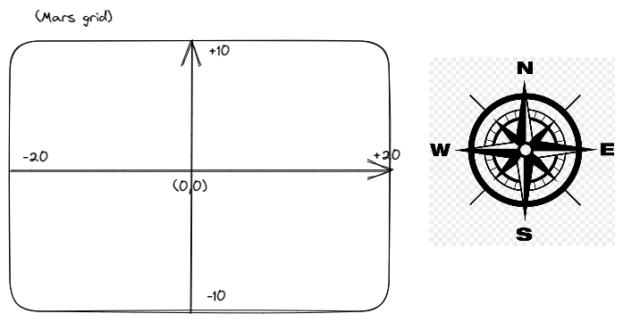

## Mars rover kata

A proposition for mars rover kata.

- The coordinates (0,0) is the center of Mars grid
- MARS_GRID_MAX_X is 20
- MARS_GRID_MAX_Y is 10

Here in our case: 
- Coordinates (+20, y) is the right edge of Mars grid
- Coordinates (-20, y) is the left edge of Mars grid
- Coordinates (x, +10) is the top edge of Mars grid
- Coordinates (x, -10) is the bottom edge of Mars grid

