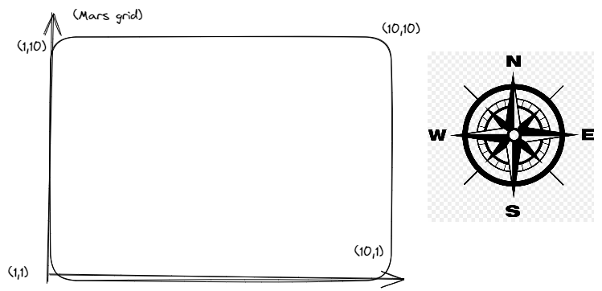

## Mars rover kata

A proposition for mars rover kata.

- The coordinates (1,1) is at the left edge of Mars grid
- MARS_GRID_MAX_X is 10
- MARS_GRID_MAX_Y is 10

Here in our case: 
- Coordinates (10, y) is the right edge of Mars grid
- Coordinates (1, y) is the left edge of Mars grid
- Coordinates (x, 10) is the top edge of Mars grid
- Coordinates (x, 1) is the bottom edge of Mars grid

